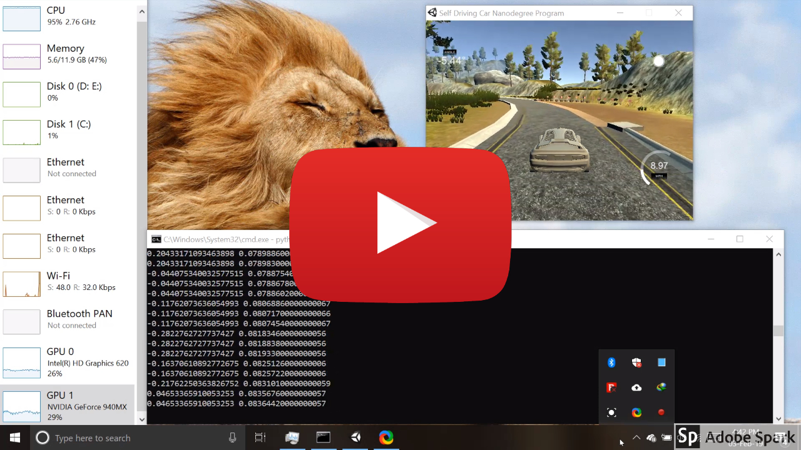
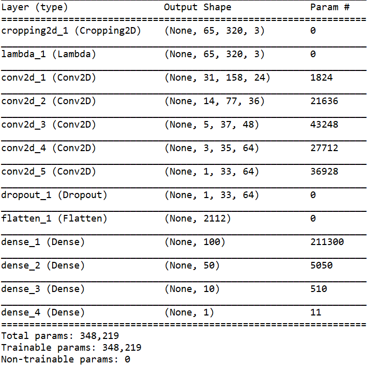

# **Behavioral Cloning** 


[](https://youtu.be/rPiW63nYH60?t=64)

## Writeup
---

**Behavioral Cloning Project**

The goals / steps of this project are the following:
* Use the simulator to collect data of good driving behavior
* Build, a convolution neural network in Keras that predicts steering angles from images
* Train and validate the model with a training and validation set
* Test that the model successfully drives around track one without leaving the road
* Summarize the results with a written report


## Rubric Points
### Here I will consider the [rubric points](https://review.udacity.com/#!/rubrics/432/view) individually and describe how I addressed each point in my implementation.  

---
### Files Submitted & Code Quality

#### 1. Submission includes all required files and can be used to run the simulator in autonomous mode

My project includes the following files:
* model.py containing the script to create and train the model
* drive.py for driving the car in autonomous mode
* model.h5 containing a trained convolution neural network 
* video.mp4 containing output video of autonomous mode driving
* README.md summarizing the results

#### 2. Submission includes functional code
Using the Udacity provided simulator, `model.h5`, and `drive.py` file, the car can be driven autonomously around the track by executing. We can store the output of simulator in the directory named `run`.
```sh
python drive.py model.h5 run
```
We can make the video of simulator's output by video.py by executing
```sh
python video.py run
```

#### 3. Submission code is usable and readable

The model.py file contains the code for training and saving the convolution neural network. The file shows the pipeline I used for training and validating the model, and it contains comments to explain how the code works.

### Model Architecture and Training Strategy

#### 1. An appropriate model architecture has been employed

My model consists of a convolution neural network that has architecture similar to the one NVIDIA used in theirs end to end machine learning self driving car. Model consists of 5 convolutional layers and 4 Dense Layers with Normalization and lambda cropping layer at the start. 

#### 2. Attempts to reduce overfitting in the model

The model contains dropout layers in order to reduce overfitting (model.py line 84). 

The model was trained and validated on different data sets to ensure that the model was not overfitting. The model was tested by running it through the simulator and ensuring that the vehicle could stay on the track.

#### 3. Model parameter tuning

The model used an adam optimizer with the learning rate of `3e-4` (model.py line 15).

#### 4. Appropriate training data

The dataset that I chose for this problem, was generated through 3 cameras mounted on the front as displayed in the image below.
So, I took all 3 feeds to train my model. I adjusted the steering angle taken by left camera by 0.25 degrees and right camera by -0.25 degrees.


For details about how I created the training data, see the next section. 

### Model Architecture and Training Strategy

#### 1. Solution Design Approach

The overall strategy for deriving a model architecture was to ...

My first step was to use a convolution neural network model similar to that of NVIDIA used in their end to end machine learning self driving car research paper. I thought this model might be appropriate because it has already been proven good for this problem.

In order to gauge how well the model was working, I split my image and steering angle data into a training and validation set. I found that my first model had a low mean squared error on the training set but a high mean squared error on the validation set. This implied that the model was overfitting. 

To combat the overfitting, I modified the model by adding `Dropout` layer.

The final step was to run the simulator to see how well the car was driving around track one. There were a few spots where the vehicle fell off the track. To improve the driving behavior in these cases, I first, generated a lot of data by myself on the simulator. I almost recorded approx 10 laps in each direction. Then I left my model to train overnight on my local gpu machine for 256 epochs.

At the end of the process, the vehicle is able to drive autonomously around the track without leaving the road.

#### 2. Final Model Architecture

The final model architecture (model.py lines 75-90) consisted of a convolution neural network with the following layers and layer sizes ...



Here is a visualization of the architecture


#### 3. Creation of the Training Set & Training Process

To capture good driving behavior, I first recorded 20 laps on track one using center lane driving. Here is an example image of center lane driving:


For some laps, I recorded the data in such a way that car tries to come in the middle of the road from the sides.
To augment the dataset I randomly flip the image and angle while generating data for the model. This is how flipped image looks like:

original image            |  flipped image
:-------------------------:|:-------------------------:
 |  


After the collection process, I had ~73k number of data points. I then preprocessed this data by using data generator method and model's lambda layer.

I finally randomly shuffled the data set and put 20% of the data into a validation set. 

I used this training data for training the model. The validation set helped determine if the model was over or under fitting. The ideal number of epochs was 256 as evidenced by the output. I used an adam optimizer with the learning rate of 3e-4